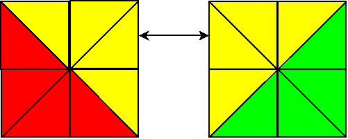

# MasterMorphix 4x4 Corner Flip script

When solving mastermorfix 4x4, one may face squares corner parity. This makes mastermorfix unsolvable.
This script helps to solve this parity by quickly swapping two yellow corners between green and red squares.

Squares elements are coded using triplets:
- gsy: (g\y - left top to the right bottom diagonal splitted square, green triangle at the left bottom, yellow triangle at the right top corner)
- ytg: (y/g - left bottom to the right top diagonal splitted square, yellow triangle is at the top left corner and green one is in front at the right bootom corner)

When crossing the horizont each element changes the order of colors, when crossing any of the borders it changes diagonal angle.
Solid elements of square are coded as two triangles with the same color. Diagonal direction matters.

    $ ./mm4_corner_flip.py
    [*] Debug mode: False
    [*] Strict mode: True
    [*] Algos to find min: 2
    [*] Input: rsrrtyrtyosogsyytygtggsy
    [*] Target: ['rsrrtyrtyysygsyotogtggsy']
    ------------------------------------
    [*] Bruteforce started: 2020-12-13 01:55:50.362227
    [*] Recursion level max: 16
    [+] SOLUTION FOUND
    [+] MOVES: R U R' F U U R U U U R' F F F R U R' L U' U' U' L' F R U R' U F L U' U' U' L' R U U U R' F F R U U U R' F F
    [+] MOVES SHORTENED: (R U R') F 2U R (U') R' (F') (R U R') L (U) L' F (R U R') U F L (U) L' R (U') R' 2F R (U') R' 2F
    [+] MOVES LEN: 16
    [*] Bruteforced in: 0:00:21.391737
    [+] SOLUTION FOUND
    [+] MOVES: R U R' F U U R U U U R' F F F R U R' L U' U' U' L' F R U R' U F L U' U' U' L' R U U U R' U U L U' L' U U
    [+] MOVES SHORTENED: (R U R') F 2U R (U') R' (F') (R U R') L (U) L' F (R U R') U F L (U) L' R (U') R' 2U (L U' L') 2U
    [+] MOVES LEN: 16
    [*] Bruteforced in: 0:00:21.423955

This script also can help to solve broken square centers. See an example:

    $ ./mm4_corner_flip.py
    [*] Debug mode: False
    [*] Strict mode: True
    [*] Algos to find min: 2
    [*] Input: rsrrtyrtyosogsyytggtgysy
    [*] Target: ['rsrrtyrtyysygsyotogtggsy']
    ------------------------------------
    [*] Bruteforce started: 2020-12-13 01:54:05.747593
    [*] Recursion level max: 10
    [+] SOLUTION FOUND
    [+] MOVES: F U R U R' R U R' R U R' L U' L' R U R' F R U U U R' F F F
    [+] MOVES SHORTENED: F U (R U R') (R U R') (R U R') (L U' L') (R U R') F R (U') R' (F')
    [+] MOVES LEN: 10
    [*] Bruteforced in: 0:00:03.104765

